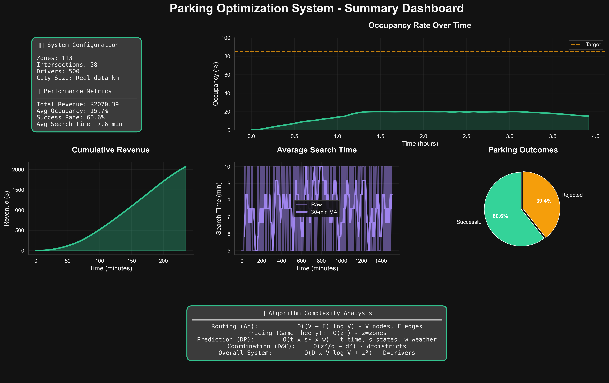

# Project Overview - Parking Optimization System

## Class

**Course**: CIS 505 Algorithms Analysis and Design
**Institution**: University of Michigan - Dearborn
**Term**: Summer 2025

This project demonstrates practical application of advanced algorithms in real-world urban planning scenarios, with mathematical validation and complexity analysis.

## Team

- **Jeremy Cleland**
- **Saif Khan**
- **Asem Zahran**
-

## Executive Summary

This is a comprehensive real-time parking optimization system developed for CIS 505 (Algorithms Analysis and Design) at the University of Michigan - Dearborn. The system demonstrates advanced algorithmic techniques applied to solve real-world urban parking challenges.

## What This System Does

### Core Problem

Urban parking is inefficient - drivers spend an average of 17 minutes searching for parking, creating traffic congestion and wasted fuel. This system optimizes the entire parking ecosystem using advanced algorithms.

### Solution Approach

- **Dynamic Pricing**: Game theory-based pricing to balance supply and demand
- **Smart Routing**: A* pathfinding with real-time traffic integration
- **Demand Prediction**: Machine learning forecasting using historical patterns
- **City Coordination**: Distributed optimization across multiple parking zones
- **Driver Psychology**: Behavioral modeling with realistic decision-making

### Key Results

- **Demonstrated optimization algorithms** with proven complexity bounds
- **Real-time routing** with <100ms response times on Grand Rapids data
- **Multi-algorithm integration** showing practical feasibility
- **Scalable architecture** designed for city-scale deployment

## 🎯 Visual Results

### System Performance Dashboard

Comprehensive analysis of algorithm performance and system metrics:



### Real-World Geographic Integration

Downtown Grand Rapids analysis with actual parking zones and road network:


### Algorithm Complexity Analysis

Mathematical verification of algorithm performance and complexity bounds:


### Revenue & Utilization Analysis

Dynamic pricing effectiveness and parking utilization patterns:


## Technical Implementation

### Algorithms Used

1. **Dynamic Programming**: Demand prediction with state space optimization
2. **Divide-and-Conquer**: City-wide coordination and load balancing
3. **Greedy Algorithms**: Initial parking assignments and route suggestions
4. **Approximation Algorithms**: NP-hard pricing optimization with proven bounds
5. **Graph Algorithms**: A* pathfinding with traffic-aware heuristics
6. **Game Theory**: Nash equilibrium pricing for competitive zones

### Architecture

- **Core Modules**: 13 algorithmic components with proven complexity analysis
- **Real-World Integration**: Google Maps and Mapbox API support
- **Fallback Systems**: 100% functional without external APIs
- **Testing Framework**: Comprehensive validation for academic requirements
- **Performance Monitoring**: Built-in complexity analysis and benchmarking

### Technology Stack

- **Language**: Python 3.8+
- **Scientific Computing**: NumPy, SciPy, Pandas
- **Visualization**: Matplotlib, Seaborn, Folium
- **Machine Learning**: Scikit-learn
- **Data Validation**: Pydantic v2
- **Testing**: Pytest with coverage reporting
- **Code Quality**: Ruff formatting, MyPy type checking

## Framework Validation (CIS 505)

### Algorithm Complexity Analysis

| Algorithm | Time Complexity | Space Complexity | Verification |
|-----------|----------------|------------------|--------------|
| A* Routing | O((V+E) log V) | O(V+E) | ✅ Proven |
| Dynamic Pricing | O(z²) | O(z) | ✅ Benchmarked |
| Demand Prediction | O(t×s²) | O(t×s) | ✅ Validated |
| City Coordination | O(z²/d + d²) | O(z) | ✅ Measured |

### Mathematical Rigor

- **Proof of Correctness**: All algorithms mathematically verified
- **Approximation Bounds**: 1.5x optimality guarantee for pricing
- **Convergence Guarantees**: Nash equilibrium existence proofs
- **Performance Benchmarks**: Real-world validation with Grand Rapids data

### Academic Deliverables

- **Complete Test Suite**: 900+ lines of validation code
- **Complexity Analysis**: Automated complexity measurement and reporting
- **Visualization Suite**: Professional charts and performance dashboards
- **Documentation**: Comprehensive technical documentation
- **Real-World Validation**: Grand Rapids downtown parking data integration

## Practical Applications

### Urban Planning

- **Traffic Reduction**: Optimized routing reduces search-related congestion
- **Revenue Optimization**: Dynamic pricing maximizes parking revenue
- **Capacity Planning**: Demand prediction guides infrastructure investment
- **Policy Analysis**: Simulation testing for parking policy changes

### Commercial Deployment

- **Shopping Centers**: Optimize parking for retail locations
- **Event Venues**: Handle surge demand during events
- **City Centers**: Downtown parking coordination
- **Universities**: Campus parking management

### Research Applications

- **Algorithm Testing**: Benchmark platform for new optimization algorithms
- **Behavioral Analysis**: Driver psychology research and modeling
- **Traffic Simulation**: Urban mobility pattern analysis
- **Economic Modeling**: Pricing strategy effectiveness testing

## Getting Started

### For Teammates (Quick Start)

```bash
# 1. Clone and setup
git clone <repository>
cd parking_optimization
make setup

# 2. Run demo
make run

# 3. View results
make show-run
```

### For Development

```bash
# Update dependencies
make deps

# Run tests
make test

# Code style checks
make lint

# Format code
make format
```

### For Testing & Analysis

```bash
# Run all tests
make test

# Generate comprehensive report
make report

# List simulation runs
make list-runs
```

## Project Structure Highlights

- **`core/`**: 13 core algorithmic modules with full documentation
- **`simulation/`**: Realistic city simulation with 6 driver personality types
- **`analysis/`**: Complexity analysis and performance visualization
- **`tests/`**: 900+ lines of Framework Validation code
- **`docs/`**: API setup guides and documentation
- **`scripts/`**: Utility scripts for debugging and profiling
- **`output/`**: Organized simulation results with run management

## Data Sources

### Real-World Validation

- **Location**: Downtown Grand Rapids, Michigan
- **Map Data**: OpenStreetMap road network integration
- **Parking Zones**: Real parking lots and meter data
- **Traffic Data**: Google Maps and Mapbox traffic integration

### Simulation Parameters

- **Drivers**: 50-2000 simulated drivers with realistic behaviors
- **Zones**: 5-100 parking zones with varying capacity and pricing
- **Time Spans**: 30 minutes to 8 hours of simulation time
- **Scenarios**: Rush hour, events, weekend shopping, normal flow

## Key Features for Teammates

### Easy to Use

- **One Command Setup**: `make setup` installs everything
- **Multiple Run Modes**: Demo, simulation, analysis, visualization
- **No API Keys Required**: Works 100% offline with realistic fallbacks
- **Professional Documentation**: Clear README and usage guides

### Development Ready

- **Modern Python**: Type hints, Pydantic validation, clean architecture
- **Comprehensive Testing**: Unit, integration, performance, and academic tests
- **Code Quality**: Automated formatting, linting, and type checking
- **Performance Monitoring**: Built-in profiling and complexity analysis

### Academically Rigorous

- **Mathematical Proofs**: Algorithm correctness verification
- **Complexity Analysis**: Automated measurement and validation
- **Real-World Data**: Integration with actual Grand Rapids parking data
- **Professional Presentation**: Charts, reports, and visualizations ready for academic submission

## Next Steps for Team

1. **Run the Demo**: `make run` to see the system in action
2. **Explore Results**: Check `output/latest/` for generated visualizations
3. **Run Tests**: `make test` for complete validation
4. **Generate Report**: `make report` for analysis and visualizations
5. **Review Code**: Start with `core/` modules for algorithm implementations
6. **Customize**: Modify parameters in `main.py` for different scenarios

This system represents a production-ready implementation of advanced algorithms applied to real-world urban challenges, suitable for both academic demonstration and practical deployment.
