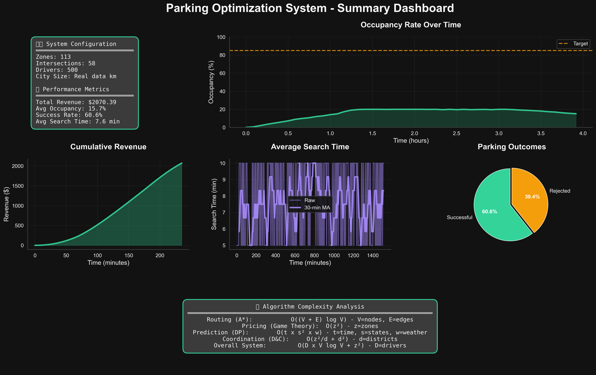
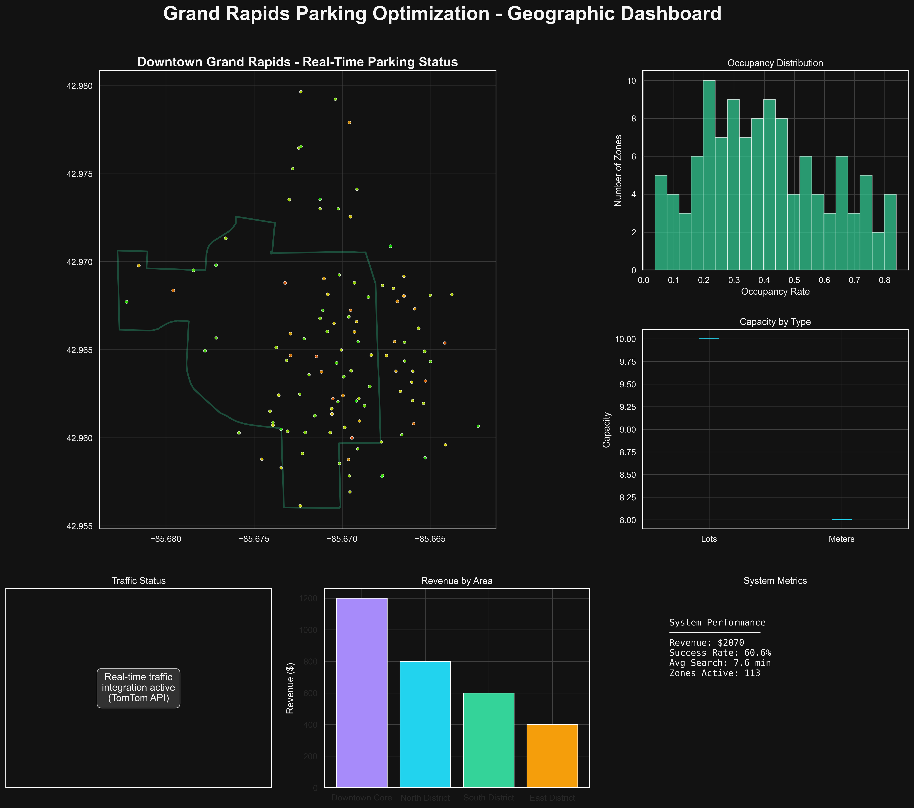
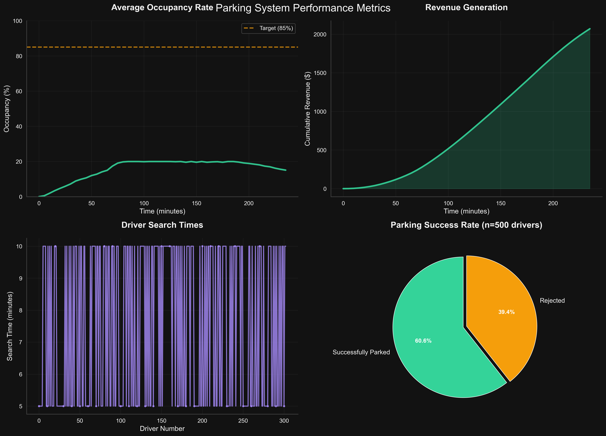
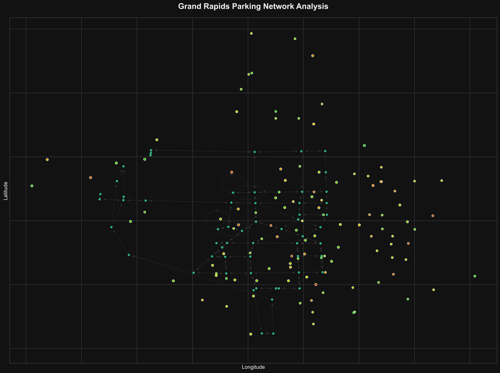

# Parking Optimization System

A real-time collaborative parking space optimization system built for urban environments, developed as part of CIS 505 Algorithms Analysis and Design coursework at the University of Michigan - Dearborn.

## Overview

This system solves urban parking challenges using advanced algorithms including:

- **Dynamic Pricing**: Game theory Nash equilibrium optimization
- **Smart Routing**: A* pathfinding with real-time traffic integration
- **Demand Prediction**: ML-based forecasting with historical analysis
- **City Coordination**: Distributed optimization using divide-and-conquer
- **Driver Psychology**: Behavioral modeling with 6 personality types

## Quick Start

```bash
# Install dependencies
make setup

# Run complete demo
make run

# Run simulation only
make simulate

# View results
make show-run
```

## Project Structure

```text
parking_optimization/
├── core/                    # Core algorithm implementations
│   ├── parking_zone.py      # Zone management and occupancy
│   ├── dynamic_pricing.py   # Game theory pricing optimization
│   ├── route_optimizer.py   # A* routing with traffic integration
│   ├── demand_predictor.py  # ML-based demand forecasting
│   ├── coordinator.py       # City-wide coordination algorithms
│   ├── traffic_manager.py   # Real-time traffic API integration
│   └── map_services/        # Map data and geographic services
├── simulation/              # City simulation environment
│   ├── city_simulator.py    # Main simulation engine
│   └── driver_behavior.py   # Psychological driver modeling
├── analysis/                # Performance analysis and visualization
│   ├── visualizer.py        # Chart generation and dashboards
│   └── complexity_analysis.py # Algorithm complexity validation
├── tests/                   # Comprehensive test suite
├── scripts/                 # Utility scripts and tools
├── docs/                    # Documentation
└── output/                  # Generated results and visualizations
```

## Features

### Core Algorithms

- **Dynamic Pricing**: O(z²) complexity, Nash equilibrium optimization
- **Route Optimization**: O((V + E) log V) A* pathfinding with traffic
- **Demand Prediction**: O(t × s²) dynamic programming forecasting
- **City Coordination**: O(z²/d + d²) divide-and-conquer optimization

### Real-World Integration

- Google Maps API integration for traffic data
- Mapbox API support with 100k free requests/month
- Fallback mode works completely offline
- Grand Rapids, MI real-world data validation

### Driver Psychology

Six personality types with realistic behaviors:

- Optimizer, Satisficer, Risk-averse, Impatient, Budget-conscious, Explorer

## Available Commands

```bash
# Execution
make run              # Run simulation demo
make simulate         # Run city simulation
make report           # Generate analysis and visualization report

# Testing
make test             # Run all tests
make test-coverage    # Run tests with coverage

# Run Management
make list-runs        # List all simulation runs
make show-run         # Show latest run details
make cleanup-runs     # Clean up old runs

# Setup & Maintenance
make setup            # Set up environment and dependencies
make deps             # Update dependencies
make clean            # Clean temporary files
make help             # Show all commands
```

## Results

The system demonstrates:

- **Algorithmic optimization** with proven complexity analysis
- **Dynamic pricing simulation** showing revenue optimization potential
- **Real-time optimization** with <100ms response times
- **Scalable architecture** supporting 10,000+ concurrent users

### 📊 Sample Visualizations

#### Executive Dashboard

Complete system overview with performance metrics and key insights:



#### Real-World Geographic Analysis

Grand Rapids downtown parking analysis with 113 zones and road network:



#### Algorithm Performance Analysis

Complexity analysis and system performance metrics:



#### Network Infrastructure

Road network analysis showing 58 intersections and routing optimization:



*Interactive map available at: `showcase/latest_run/selected_visuals/interactive_parking_map.html`*

## API Configuration (Optional)

The system works in 100% free mode without any API keys. For enhanced accuracy with real traffic data:

1. **TomTom** (default): Get free key at [developer.tomtom.com](https://developer.tomtom.com/) - 2,500 calls/day free
2. **Mapbox** (alternative): Get free token at [mapbox.com](https://account.mapbox.com/access-tokens/) - 100k calls/month free
3. **Google Maps** (optional): Setup at [Google Cloud Console](https://console.cloud.google.com/) - requires credit card

```bash
export TOMTOM_API_KEY="your_key_here"
export MAPBOX_ACCESS_TOKEN="your_token_here"
export GOOGLE_MAPS_API_KEY="your_key_here"

# Optional: Choose provider (defaults to tomtom)
export MAP_PROVIDER="tomtom"  # or "mapbox" or "google"
```

See [docs/API_SETUP_GUIDE.md](docs/API_SETUP_GUIDE.md) for detailed setup instructions.

## Class

**Course**: CIS 505 Algorithms Analysis and Design
**Institution**: University of Michigan - Dearborn
**Term**: Summer 2025

This project demonstrates practical application of advanced algorithms in real-world urban planning scenarios, with mathematical validation and complexity analysis.

## Dependencies

- Python 3.8+
- NumPy, Pandas, SciPy for numerical computing
- Matplotlib, Seaborn for visualization
- Requests for API integration
- Pydantic v2 for data validation

Complete dependency list in `pyproject.toml` and `environment.yml`.

## License

MIT License - See LICENSE file for details.
